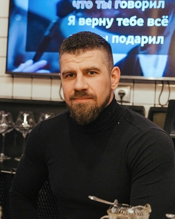

# Кратко о себе

 

Привет, меня зовут _Кирюшин Илья_

Мне 37 лет

Я работаю в сфере автомобильного бизнеса более 15 лет. Занимаюсь организацией:
- Ремонта транспортных средств
- Технического обслуживания
- Закупкой запасных частей
- Выпуском на линию подвижного состава

## Почему я решил сменить профессию

1.	Профессиональное выгорание
2. 	Интерес к технологиям
3.	Стремление к более гибкому графику работы
4.	Широкие возможности для карьерного роста 
5.	Высокая оплата труда

